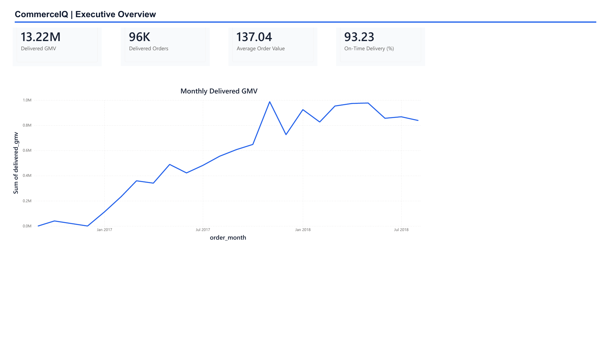

# CommerceIQ: End-to-End E-Commerce Analytics Platform

CommerceIQ is a portfolio-quality analytics project built around the public Brazilian Olist E-Commerce dataset. It demonstrates an end-to-end workflow: source-data auditing, cleaning, relational modeling, PostgreSQL analysis, KPI development, Power BI dashboarding, and business communication.

The project is intentionally developed in phases. Findings will be added only after they are calculated from the source files; this repository does not contain invented statistics.

## Business Problem

An e-commerce marketplace needs a reliable view of commercial performance and customer experience across customers, orders, sellers, products, payments, reviews, and delivery operations. CommerceIQ will turn these related operational datasets into consistent analytical tables and decision-ready metrics.

The eventual analysis will help stakeholders understand revenue performance, order trends, delivery reliability, customer satisfaction, product and category performance, seller performance, and geographic patterns.

## Dataset Description

The [Brazilian E-Commerce Public Dataset by Olist](https://www.kaggle.com/datasets/olistbr/brazilian-ecommerce) contains anonymized marketplace transactions from Brazil across multiple related CSV files. The source includes data about:

- customers and customer locations
- orders and order-status timestamps
- order items, products, and sellers
- payments and payment installments
- customer reviews
- product-category translations
- geolocation reference data

The CSV files are not committed to Git. Download them separately and place them in `data/raw/` without renaming or modifying them.

## Technology Stack

- Python, pandas, and NumPy for data preparation and analysis
- Jupyter for reproducible analytical notebooks
- PostgreSQL and SQLAlchemy for relational storage and querying
- Matplotlib, Plotly, and Power BI for visualization and stakeholder reporting
- pytest for automated testing
- Git and GitHub for version control and project documentation

## Repository Structure

```text
commerceiq-analytics/
├── README.md
├── requirements.txt
├── .gitignore
├── data/
│   ├── raw/                    # Original CSV files (not tracked)
│   └── processed/              # Reproducible cleaned outputs (not tracked)
├── docs/
│   ├── cleaning_rules.md
│   ├── analysis_findings.md
│   ├── conclusion.md
│   ├── database_setup.md
│   ├── kpi_definitions.md
│   └── data_model.md
├── notebooks/
│   ├── 01_data_quality_audit.ipynb
│   └── 02_exploratory_analysis.ipynb
├── scripts/
│   ├── run_data_cleaning.py
│   ├── run_analytics.py
│   ├── run_database_load.py
│   └── run_data_quality_audit.py
├── src/
│   ├── __init__.py
│   ├── config.py
│   ├── data_cleaning.py
│   ├── data_quality.py
│   ├── feature_engineering.py
│   └── database_loader.py
├── sql/
│   ├── schema.sql
│   ├── data_quality_checks.sql
│   ├── kpi_queries.sql
│   └── advanced_analysis.sql
├── dashboard/
│   ├── commerceiq_dashboard.pbix
│   ├── data/                   # Dashboard-ready Excel source
│   └── exports/                # Static dashboard export
├── reports/                    # Reproducible generated outputs
├── images/                     # Dashboard page previews
└── tests/
```

## Analytical Questions

1. How do order volume and revenue change over time?
2. Which product categories, sellers, and regions drive marketplace performance?
3. Where do delivery delays occur, and how do they affect review scores?
4. How do payment methods and installment behavior vary across orders?
5. What share of customers make repeat purchases under a stable customer definition?
6. Which sellers combine strong sales with reliable fulfillment and customer satisfaction?
7. Are cancellations or low review scores concentrated in particular operational segments?

## KPI Framework

- gross merchandise value (GMV)
- total orders and delivered orders
- average order value (AOV)
- cancellation rate
- on-time delivery rate
- average delivery time and average delivery delay
- average review score and low-review rate
- repeat-customer rate
- active sellers and seller-level GMV
- category and geographic revenue contribution

Metric definitions, filters, grain, and interpretation limits are documented in
[`docs/kpi_definitions.md`](docs/kpi_definitions.md).

## Dashboard

The stakeholder dashboard is available as
[`dashboard/commerceiq_dashboard.pbix`](dashboard/commerceiq_dashboard.pbix).
It contains three report pages:

1. **Executive Overview** - delivered GMV, delivered orders, average order value,
   on-time delivery, and monthly GMV trend.
2. **Operations & Experience** - the relationship between delivery timing and
   low reviews, plus the order-status distribution.
3. **Customers & Markets** - delivered GMV by customer state and payment value
   by payment method.



The source workbook, static PDF, page previews, metric semantics, and refresh
instructions are described in [`dashboard/README.md`](dashboard/README.md).

## Selected Findings

- Delivered item GMV is **R$13.22 million** across **96,478 delivered orders**,
  with delivered AOV of **R$137.04**.
- **93.23%** of comparable delivered orders arrived on or before the estimated
  calendar date.
- The low-review rate rises from **9.16%** for orders delivered at least two
  days early to **79.18%** for orders delivered eight or more days late.
- São Paulo contributes **38.33%** of delivered GMV; São Paulo, Rio de Janeiro,
  and Minas Gerais together contribute **63.38%**.
- Credit cards represent **78.34%** of payment value, while the observed
  repeat-customer rate is **3.00%**.

See [`docs/executive_summary.md`](docs/executive_summary.md) for the concise
stakeholder narrative and [`docs/analysis_findings.md`](docs/analysis_findings.md)
for supporting interpretation. The final decision-oriented synthesis is in
[`docs/conclusion.md`](docs/conclusion.md).

## Installation

From PowerShell, run:

```powershell
cd "C:\path\to\commerceiq-analytics"
python -m venv .venv
.\.venv\Scripts\Activate.ps1
python -m pip install --upgrade pip
python -m pip install -r requirements.txt
python -m jupyter lab
```

Copy `.env.example` to `.env` only when database connectivity is introduced. Never commit `.env` or credentials.

## Running the Data-Quality Audit

The audit is a command-line pipeline rather than notebook-only logic. From the
repository root, run:

```powershell
python scripts\run_data_quality_audit.py
```

The pipeline recursively discovers CSV files below `data/raw`, audits them
without modifying the source data, and writes the following generated files to
`reports/data_quality/`:

- `table_overview.csv` — row counts, column counts, duplicates, and key candidates
- `column_quality.csv` — inferred types and missingness for every column
- `timestamp_issues.csv` — parse results for timestamp-like columns
- `issue_register.csv` — consolidated warnings and load failures
- `schema_checks.csv` — expected versus observed source columns
- `key_checks.csv` — null and duplicate checks for declared keys
- `relationship_checks.csv` — foreign-key coverage and orphan counts
- `business_rule_checks.csv` — allowed values and timestamp-order checks
- `audit_summary.json` — structured run metadata and full table-level results

After the pipeline completes, open `notebooks/01_data_quality_audit.ipynb` to
review and communicate the findings. The notebook reads these generated reports
and does not contain the audit engine.

Optional path overrides are available for automated or alternate local runs:

```powershell
python scripts\run_data_quality_audit.py --raw-data-dir data\raw --report-dir reports\data_quality
```

Run the automated tests with:

```powershell
python -m pytest -q
```

## Running the Cleaning Pipeline

Run the quality audit first, then generate processed analytical tables:

```powershell
python scripts\run_data_quality_audit.py
python scripts\run_data_cleaning.py
```

The cleaning command writes validated tables to `data/processed/` and creates a
lineage manifest plus post-cleaning checks in `reports/data_cleaning/`. Raw CSVs
remain unchanged. See `docs/cleaning_rules.md` for every transformation and the
rationale behind it.

## Loading PostgreSQL

Validate the processed files and database contracts without connecting:

```powershell
python scripts\run_database_load.py --dry-run
```

After PostgreSQL is installed, the `commerceiq` database exists, and local `.env`
credentials are configured, run:

```powershell
python scripts\run_database_load.py
```

The loader is transactional and idempotent: it creates the managed schema,
reloads tables in dependency order, verifies row counts, and executes database
integrity checks. See `docs/database_setup.md` for setup and safety details.

## Running the Analytics

After the database load, generate all documented KPI and advanced-analysis
extracts:

```powershell
python scripts\run_analytics.py
```

The command executes the named queries in `sql/kpi_queries.sql` and
`sql/advanced_analysis.sql`, validates their output contracts, and writes
reproducible CSVs plus a checksum manifest to `reports/analytics/`. Open
`notebooks/02_exploratory_analysis.ipynb` to review the presentation layer.

## Current Project Status

**Phase 5 - end-to-end analytics platform and stakeholder dashboard complete.**

The repository includes the source audit, relational contracts, tested cleaning
pipeline, lineage manifest, normalized PostgreSQL database, transactional
loader, integrity SQL, documented KPI queries, reproducible analytical extracts,
exploratory notebook, evidence-based business findings, dashboard-ready source
workbook, three-page Power BI report, and verified static previews.

## Future Improvements

- add a GitHub Actions workflow for automated tests and linting
- automate dashboard refresh against a scheduled PostgreSQL extract
- add contribution-margin analysis if product cost data becomes available
- publish the Power BI report through a governed workspace when sharing is needed
- evaluate new customer cohorts as additional observation periods become available
