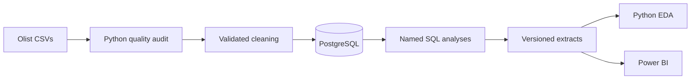

# CommerceIQ: End-to-End E-Commerce Analytics Platform

> **Independent portfolio project:** This project is not affiliated with,
> endorsed by, or created for CommerceIQ, Inc. The name "CommerceIQ" is used
> solely as the title of this personal analytics project. See the full
> [affiliation notice](NOTICE.md).

[](https://github.com/ryanjoemcmanus/commerceiq-analytics/actions/workflows/ci.yml)
[](https://www.python.org/)
[](https://www.postgresql.org/)
[](https://powerbi.microsoft.com/)
[](LICENSE)

This independent portfolio project is an analytics platform built from the public
Brazilian Olist e-commerce dataset. It turns nine related CSV files into a
tested PostgreSQL model, reproducible SQL analyses, Python exploratory work,
and a stakeholder-facing Power BI dashboard.

The project demonstrates the complete analytical workflow: **data quality,
cleaning, relational modeling, SQL, KPI design, visualization, and business
communication**.


## Business question

How can an e-commerce marketplace protect customer experience while growing,
focus operational effort where commercial value is concentrated, and convert
more first-time buyers into repeat customers?

## Executive findings

| Finding | Observed result | Business implication |
|---|---:|---|
| Delivered item GMV | **R$13.22M** across **96,478 delivered orders** | Growth should be evaluated with service quality, not volume alone. |
| Delivery reliability | **93.23%** on time among comparable delivered orders | The overall result is strong, but late-order exceptions remain material. |
| Late delivery and reviews | Low-review rate rises from **9.16%** when 2+ days early to **79.18%** when 8+ days late | Delivery exception prevention is the clearest customer-experience lever. |
| Geographic concentration | SP, RJ, and MG contribute **63.38%** of delivered GMV | Operational monitoring should begin in the highest-value states. |
| Customer retention | Observed repeat-customer rate is **3.00%** | Structured post-purchase and service-recovery experiments are the largest visible growth opportunity. |
| Payment mix | Credit cards represent **78.34%** of payment value | Conversion and cash-flow analysis should retain payment method and installment detail. |

These results describe the finite historical Olist observation window. They are
associations and descriptive findings, not causal estimates or live-company
forecasts.

## Deliverables

- [Interactive Power BI report](dashboard/commerceiq_dashboard.pbix)
- [Three-page stakeholder PDF](dashboard/exports/commerceiq_dashboard.pdf)
- [Executive summary](docs/executive_summary.md)
- [Decision-oriented conclusion](docs/conclusion.md)
- [Complete findings](docs/analysis_findings.md)
- [Executed data-quality notebook](notebooks/01_data_quality_audit.ipynb)
- [Executed exploratory-analysis notebook](notebooks/02_exploratory_analysis.ipynb)
- [Standalone notebook exports](reports/notebooks/)
- [KPI definitions](docs/kpi_definitions.md)
- [Architecture and ERD](docs/architecture.md)
- [Project walkthrough presentation](presentation/commerceiq-project-walkthrough.pptx)

## Suggested review path

| Time | Start here | What it covers |
|---:|---|---|
| 2 minutes | [Dashboard PDF](dashboard/exports/commerceiq_dashboard.pdf) | Headline KPIs, operational patterns, and market concentration |
| 5 minutes | [Project walkthrough](presentation/commerceiq-project-walkthrough.pptx) | The complete story from raw files to recommendations |
| 10 minutes | [Executive summary](docs/executive_summary.md) and [architecture](docs/architecture.md) | Business interpretation, data flow, and relational design |
| Technical review | [Tests](tests/), [SQL](sql/), and [source code](src/) | Validation rules, metric logic, and reusable implementation |

The [documentation index](docs/README.md) connects each decision to its
definition, implementation, and supporting output.

## Architecture



Raw files remain immutable. Python owns audit and cleaning behavior, PostgreSQL
owns the normalized analytical model, SQL owns metric semantics, and the
presentation layers consume validated extracts. See
[docs/architecture.md](docs/architecture.md) for the full entity-relationship
diagram and grain safeguards.

## Power BI dashboard

| Executive Overview | Operations & Experience | Customers & Markets |
|---|---|---|
|  |  |  |

The report provides headline KPIs, the monthly GMV trend, delivery-timing and
review behavior, order fulfillment status, state concentration, and payment
mix. Business-language labels, cross-highlighting, tooltips, an Order Month
range control, and a Customer State selector support guided exploration.

Metric definitions and refresh instructions are documented in
[dashboard/README.md](dashboard/README.md).

## Technology stack

| Layer | Tools |
|---|---|
| Data processing | Python, pandas, NumPy, pathlib |
| Data quality | Reusable contracts, relational checks, pytest |
| Database | PostgreSQL 18, SQLAlchemy, psycopg |
| Analysis | SQL, pandas, Plotly, Jupyter |
| Dashboard | Power BI Desktop, DAX, Excel analytical extracts |
| Engineering | Git, GitHub Actions, Ruff |

## Repository structure

```text
commerceiq-analytics/
├── .github/workflows/       # Automated linting and tests
├── dashboard/               # PBIX, theme, source workbook, PDF export
├── data/                    # Ignored raw and processed data locations
├── docs/                    # Indexed model, KPI, findings, and business narrative
├── images/                  # Verified dashboard previews
├── notebooks/               # Executed audit and exploratory notebooks
├── presentation/            # Short project walkthrough and speaker notes
├── reports/                 # Reproducible quality and analytical evidence
├── scripts/                 # Command-line pipeline entry points
├── sql/                     # Schema, integrity checks, KPIs, advanced analysis
├── src/                     # Reusable application and validation logic
└── tests/                   # Automated unit and pipeline tests
```

## Dataset

Download the [Brazilian E-Commerce Public Dataset by Olist](https://www.kaggle.com/datasets/olistbr/brazilian-ecommerce),
extract it anywhere below `data/raw/`, and leave the original files unchanged.
Nested extraction folders are supported.

The expected source domain includes customers, orders, items, payments,
reviews, products, sellers, geolocation, and product-category translations.
Downloaded data is intentionally excluded from Git.

## Quick start

From PowerShell:

```powershell
git clone https://github.com/ryanjoemcmanus/commerceiq-analytics.git
cd commerceiq-analytics
python -m venv .venv
.\.venv\Scripts\Activate.ps1
python -m pip install --upgrade pip
python -m pip install -r requirements-dev.txt
Copy-Item .env.example .env
```

Configure local PostgreSQL credentials in `.env`; never commit that file.
Database setup instructions are in [docs/database_setup.md](docs/database_setup.md).

## Rebuild the project

Run each stage from the repository root:

```powershell
python scripts\run_data_quality_audit.py
python scripts\run_data_cleaning.py
python scripts\run_database_load.py
python scripts\run_analytics.py
```

The loader is transactional and idempotent. It validates processed files,
replaces managed tables in dependency order, verifies row counts, and runs
database integrity checks. Analytical SQL outputs include a checksum manifest.

Open the presentation layers after the pipeline completes:

```powershell
python -m jupyter lab
```

## Quality checks

```powershell
python -m ruff check src scripts tests
python -m pytest -q
```

The repository currently contains **23 passing automated tests**. GitHub Actions
runs the same lint and test checks for pushes and pull requests to `main`.

## Metric contract

- Delivered GMV is item price on delivered orders; freight is excluded.
- Delivered AOV is delivered GMV divided by delivered orders.
- On-time delivery compares calendar dates and ignores time of day.
- Low reviews are order-level average review scores less than or equal to 2.
- Repeat customers use `customer_unique_id` and at least two delivered orders.
- Payment-method order counts are not additive because an order may contain
  multiple payment records.

See [docs/kpi_definitions.md](docs/kpi_definitions.md) for grain, filters,
formulas, and interpretation limits.

## Recommended actions

1. Create a daily late-order watchlist using estimated delivery date, carrier
   handoff, seller, and destination state.
2. Monitor GMV and order growth beside on-time delivery and low-review rates.
3. Prioritize operational review in the highest-GMV states and categories.
4. Test cohort-based post-purchase, replenishment, and service-recovery journeys.
5. Preserve payment method and installment detail in conversion reporting.

## Analytical boundaries

- The public data does not contain product cost, marketing spend, acquisition
  cost, or contribution margin.
- Delivery and review patterns are associations, not causal attribution.
- Repeat behavior is constrained by the historical observation window.
- The results should be revalidated before application to a live marketplace.

## License

Code and documentation are available under the [MIT License](LICENSE). The
Olist dataset remains subject to the terms of its original publisher and is not
redistributed in this repository.
