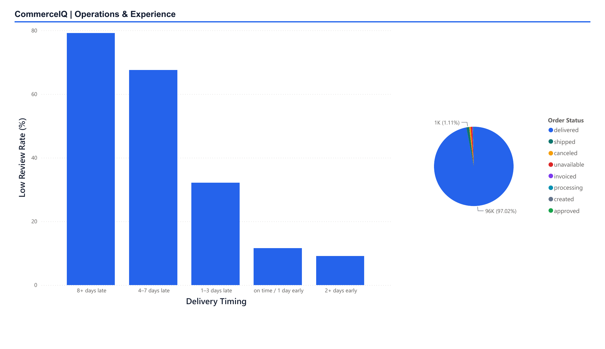
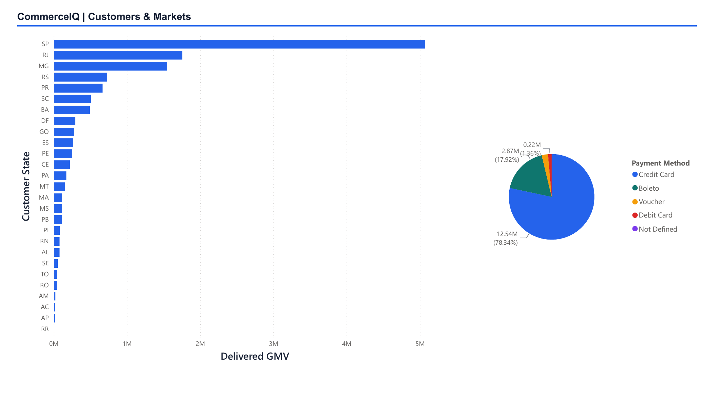

# CommerceIQ Power BI Dashboard

This directory contains the stakeholder-facing reporting layer for CommerceIQ.
The dashboard uses validated aggregate outputs from the PostgreSQL analytics
pipeline; it does not calculate business metrics directly from the raw Olist
CSV files.

## Files

- `commerceiq_dashboard.pbix` - interactive three-page Power BI Desktop report.
- `commerceiq-theme.json` - reusable CommerceIQ color and typography theme.
- `data/commerceiq-dashboard-source.xlsx` - version-controlled dashboard source
  workbook containing the ten validated analytical extracts.
- `exports/commerceiq_dashboard.pdf` - static three-page portfolio export.
- `../images/commerceiq-dashboard-*.png` - rendered page previews used by the
  repository documentation.

## Report Pages

### Executive Overview

Provides the headline marketplace view: delivered item GMV, delivered orders,
delivered AOV, on-time delivery rate, and the monthly delivered-GMV trend. The
month field is typed as a Power BI Date so the horizontal axis displays calendar
labels rather than Excel serial values. An **Order Month** range control lets a
stakeholder focus the trend on a specific reporting window.

### Operations & Experience

Compares low-review rates across delivery-timing bands and shows the distribution
of order statuses. This page supports the operational recommendation to prevent
late deliveries and proactively manage delivery exceptions.

### Customers & Markets

Shows delivered GMV by customer state and payment value by payment method. It
highlights the commercial concentration in Brazil's largest states and the
importance of credit-card and installment behavior. A **Customer State**
dropdown supports focused market comparisons without crowding the page.

## Metric Semantics

- Delivered GMV is item price on delivered orders; freight is excluded.
- Delivered AOV is delivered GMV divided by delivered orders.
- On-time delivery compares calendar dates and ignores time of day.
- Low reviews are order-level average review scores less than or equal to 2.
- Customer identity is based on `customer_unique_id`.
- Payment-method order counts are not additive because an order may have more
  than one payment record.

The full definitions and interpretation limits are in
[`../docs/kpi_definitions.md`](../docs/kpi_definitions.md).

## Open and Refresh

1. Run the audit, cleaning, database load, and analytics commands from the main
   README when rebuilding the project from raw data.
2. Open `commerceiq_dashboard.pbix` in Power BI Desktop.
3. If Power BI requests a source location, select the repository copy at
   `dashboard/data/commerceiq-dashboard-source.xlsx` and apply the change to all
   workbook queries.
4. If the source workbook must be rebuilt, replace its tables using the
   validated CSVs generated in `reports/analytics/`, preserving table names and
   column types.
5. Select **Refresh** in Power BI and confirm that every page renders without
   errors before saving or exporting.

The dashboard source tables are intentionally pre-aggregated at different
business grains. They should remain disconnected unless a relationship is
explicitly required and its one-to-many cardinality has been validated.

## Review Options

The PDF export provides a no-installation preview. Use the PBIX for date and
state filtering, tooltips, cross-highlighting, sorting, and deeper inspection
in Power BI Desktop.
