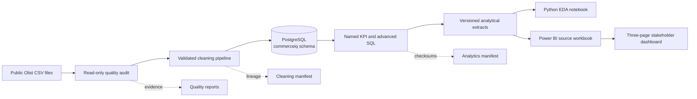
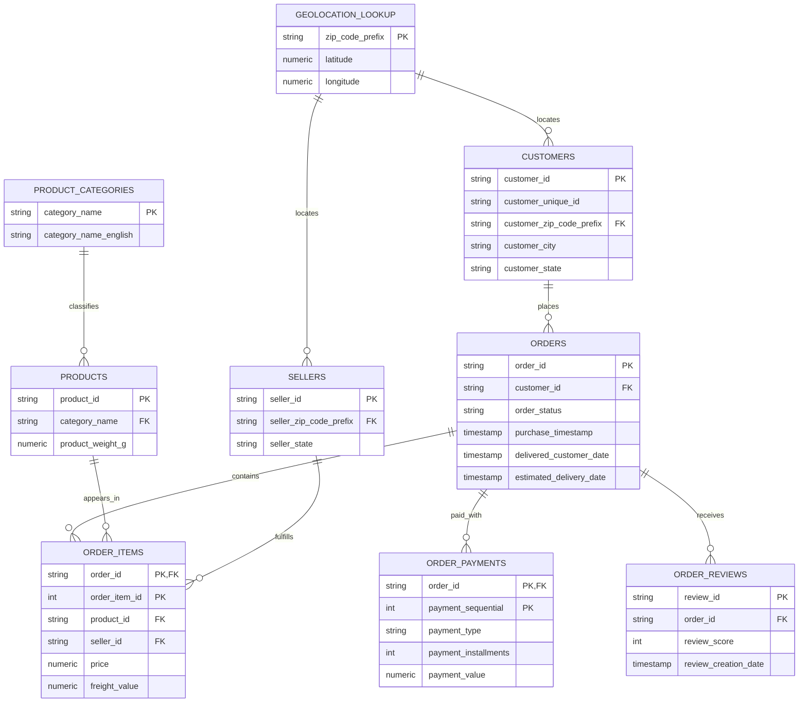

# CommerceIQ Architecture and Data Model

## Analytical architecture

The boundaries are deliberate. Raw files remain immutable; reusable Python owns
data validation and cleaning; PostgreSQL owns the normalized analytical model;
SQL owns KPI semantics; notebooks and Power BI consume validated outputs rather
than redefining metrics independently.

## Relational model

## Grain and metric safeguards

- Orders are unique at `order_id`.
- Items are unique at `(order_id, order_item_id)`.
- Payments are unique at `(order_id, payment_sequential)` and are not additive
  as order counts across methods because one order can use multiple records.
- Reviews are aggregated to the order grain before joining to order-level KPIs.
- Delivered GMV is item price on delivered orders and excludes freight.
- Customer retention uses `customer_unique_id`, not the order-specific
  `customer_id`.

See [data_model.md](data_model.md) for implementation details and
[kpi_definitions.md](kpi_definitions.md) for the complete semantic contract.
