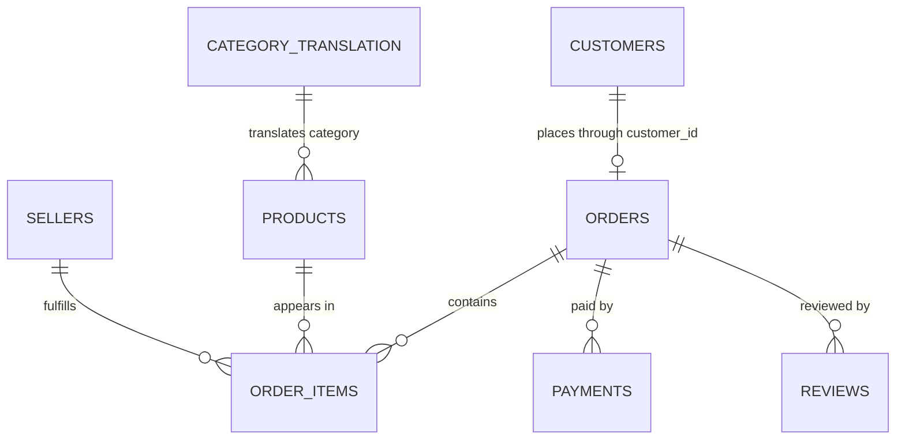

# CommerceIQ Source Data Model

This document defines the observed grain and intended relational contract of
the nine Olist source tables. These contracts are validated by code before any
cleaning or database loading occurs.

## Relationship Overview

Geolocation is intentionally excluded from the strict relationship diagram.
ZIP-code prefixes are not unique in that source: each prefix can have multiple
latitude/longitude observations and spelling variants. A derived geographic
lookup must be designed before joining geolocation to customers or sellers.

## Table Grain and Keys

| Source file | Grain | Declared key |
|---|---|---|
| `olist_customers_dataset.csv` | One marketplace customer record | `customer_id` |
| `olist_geolocation_dataset.csv` | One geolocation observation | No source key declared |
| `olist_orders_dataset.csv` | One order | `order_id` |
| `olist_order_items_dataset.csv` | One item sequence within an order | `order_id + order_item_id` |
| `olist_order_payments_dataset.csv` | One payment sequence within an order | `order_id + payment_sequential` |
| `olist_order_reviews_dataset.csv` | One review-order association | `review_id + order_id` |
| `olist_products_dataset.csv` | One product | `product_id` |
| `olist_sellers_dataset.csv` | One seller | `seller_id` |
| `product_category_name_translation.csv` | One Portuguese category name | `product_category_name` |

`customer_id` identifies the customer record attached to an order.
`customer_unique_id` is the cross-order customer identity intended for repeat
customer analysis. These fields must not be treated as interchangeable.

The review table uses a composite key because review identifiers and order
identifiers are not independently guaranteed to be unique in the source.

## Declared Foreign Keys

- orders `customer_id` → customers `customer_id`
- order items `order_id` → orders `order_id`
- order items `product_id` → products `product_id`
- order items `seller_id` → sellers `seller_id`
- payments `order_id` → orders `order_id`
- reviews `order_id` → orders `order_id`
- products `product_category_name` → category translation `product_category_name`

The category relationship is nullable and non-strict during raw-source
validation. Cleaning promotes untranslated categories into the processed
category dimension with fallback labels and quality flags. PostgreSQL can then
enforce the non-null category references without discarding products; products
whose source category is genuinely missing retain a nullable foreign key.

## Timestamp Rules

The validation pipeline checks the following chronological expectations when
both values are present:

- purchase ≤ approval
- purchase ≤ carrier handoff
- purchase ≤ customer delivery
- purchase ≤ estimated delivery
- approval ≤ carrier handoff
- carrier handoff ≤ customer delivery
- review creation ≤ review answer

Violations are marked for review. They are not automatically corrected because
they may represent source-system timing behavior, retrospective updates, or
genuine data errors.

## Source-Preservation Rules

- Raw CSV files are immutable and remain excluded from Git.
- Source column names are validated exactly, including Olist's original
  `*_lenght` spelling. Friendly corrected names belong in processed tables.
- No row is deleted solely because it has a missing optional attribute.
- Key, relationship, and timestamp exceptions must be measured before a
  cleaning rule is approved.
